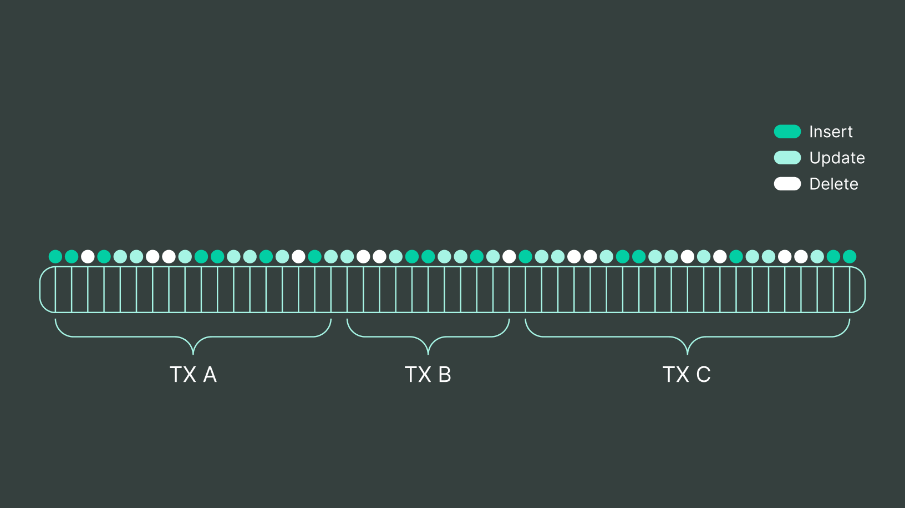
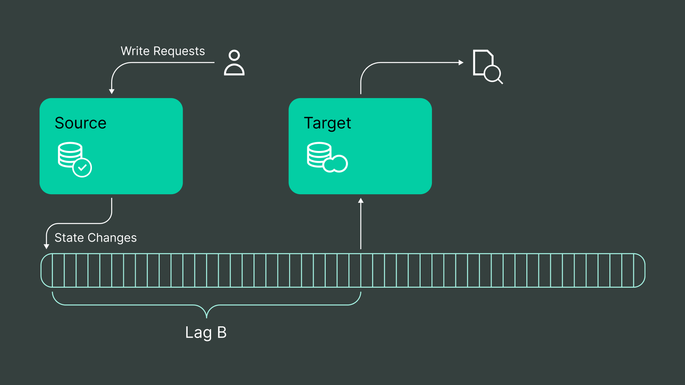

# Data Integrity

The critical aspects of data replication are consistency and integrity. Multiple design decisions address these aspects within our service. First, we decided not to build a strict, consistent system but to aim to be eventually consistent. Those allow us to minimize latency and be more aggressive in parallelization (such as table-level parallelization). Each table owns its version: a pair of transaction IDs and commits time. At each point in time, the whole state of the replicated target may be inconsistent, but each table must be consistent.

To allow optional user point-in-time consistency, we may deliver raw events log into the target so that the user may restore a point-in-time snapshot from that log.

## Delivery semantics

The delivery semantics of each connector determine its correctness and fault tolerance. We need to support several different delivery semantics. Since we support various databases with their mechanisms, we must have flexibility in semantic strategies. Using at least one stream as input is acceptable for some storages since we may upsert data instead of inserts. Upserts are not an option for analytical databases, so we must find a solution.

The **{{ data-transfer-name }}** worker does the following types of work:

1. **Consume input**. For example, it may consume bin logs from some checkpoints. This work usually runs without side effects; we pull data in memory and deserialize it to a common type.
2. **Process input**. Based on the input stream of events and in-memory state, it processes it via YQL transformers and generates output for a target for further processing or serving. This can happen as source events are processed or can be synchronized before or after a checkpoint.
3. **Push output**. Take generalized output and push it to target storage. This work type has side effects, so it must be handled carefully. Before insertion, we check the progress tracker for which part of incoming data is stale and must be skipped.
4. **Store checkpoints**. Save checkpoints to a database for failure recovery. We must store both source and target database checkpoints. Initially, we store the target checkpoint; if the database supports the transaction, we try to do so in the same transaction as the output write. Some targets do not support transactions. For them, we use separate system tables for progress tracking. Once we store the progress of the target, we may commit progress to a source. For some databases, it's important to store checkpoints as fast as possible since internal processes can't clear used transaction logs.

The implementations of these activities, especially the checkpoints, control the processors' semantics. There are two kinds of relevant semantics:

1. **Source semantics**: each source event counts `at-least-once` or `exactly-once`.
2. **Target semantics**: a given output value shows up in the output stream `at-least-once` or `exactly-once`.

The different state semantics depend only on the order of saving the offsets between the source and target.

* **At-least-once state semantics**: save the target offset first, then save the source offset.
* **At-most-once state semantics**: save the source offset first, then save the target offset.
* **Exactly-once state semantics**: we may create exactly-once processing from an at-least-once source by skipping duplicate data before sinker; this is implemented as optional middleware with derived state storage. The only thing required for that is the ability to store progress inside the target database in the same transaction as the original insert.

We allow the user to choose which semantic applies to him. By default, we do not force the `exactly-once` and stay on the `at-least-once`. The tricky part is that the most popular storages support the `upsert` operation, and most source databases provide natural primary keys. By implementing `upsert` by default, we have a ready solution to handle duplicates.

## Summary

From a contractual point of view, consistency at the table/row level **makes no difference** to us. We cannot determine clear signs to define with what level of assurance we have read the data from the source.

A streaming primitive. An endless stream of CRUD events line by line. Conceptually, there are only three types of events in logical replication - `create/edit/delete`. For editing and deleting, we need to identify the object with which we operate, so to support such events, we expect the source to be able to give them.

For some storages, such events can be grouped into **transactions**.

Once we start the replication process, we apply this stream of actions to the target and try to minimize our data lag between the source database and the target.

At the replication source level, we maintain multiple levels of consistency:

### Row

This is the most basic mechanism. If the source does not link strings to each other, there is a guarantee only at the string level. An example of MongoDB in FullDocument mode, each event in the source is one row living in its timeline. Events with this level of assurance do not have a transaction tag and logical source time (LSN) or are not in a strict order.

### Table

Suppose the rows begin to exist in a single timeline - we can provide consistency at the table level. In that case, applying the entire stream of events in the same order as received gives us a consistent slice of the table. Eventually, events with this guaranteed level don’t have a transaction stamp but contain a logical source timestamp (LSN) and a strict order.

### Transaction

Suppose the rows live in a single timeline and are attributed with transaction labels and linearized in the transaction log (that is, there is a guarantee that all changes in one transaction are continuous and the transactions themselves are logically ordered). In that case, we can give consistency at the table and transaction levels. Applying the entire stream of events in the same order with the same (or larger) batches of transactions, we will get a consistent table slice from the source at any moment.

## Target

Each of our Targets is a simple thing that can consume a stream of events; at its level, the target can both support source guarantees and weaken them.

### Primitive

At the most basic level, the target simply writes everything that comes in (the classic example is the` / fs / s3` queue). At this level, we do not guarantee anything other than writing everything that comes in (while the records may be duplicated).

### Unique key deduplication

The Target can de-duplicate the row by the primary key, in which case we give an additional danger - there will be no key duplicates on the target.

### Logical clock deduplication

If the Target can write up to 2 tables in a single transaction, we can transactionally store the source logical timestamp in a separate table and discard already written rows. In this case, the targets will have no duplicates, including lines without keys.

### Transaction boundaries

If the receiver can hold transactions for an arbitrarily long time and apply transactions of arbitrary size, we can implement saving transaction boundaries on writes. In this case, the sink will receive rows in the same or larger transactions, giving an exact source segment at any time.
