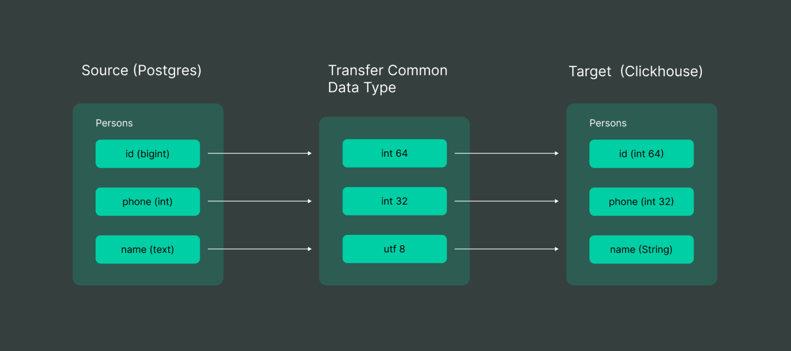

# Schema Management

{{ data-transfer-name }} ensures seamless schema evolution during data replication:

## Features
- Infers source schema and maps it to a common type system.
- Supports schema versioning and registry-based enrichment.

## Schema Evolution
- Handles column additions, type changes, and removals.
- Supports user-defined strategies (e.g., reupload, ignore, drop, panic).

{{ data-transfer-name }} minimizes disruptions by isolating schema changes from downstream systems.

{{ data-transfer-name }} uses schematized serialization of events and supports schema versioning and evolution, providing an isolation layer that protects consumers from upstream changes in the schema. The source provides a schema infer into a common schema by inspecting the source tables.
The following diagram shows a simple PostgreSQL table mapped to a common type schema.

## Schema consistency

**{{ data-transfer-name }}** uses schematized serialization of events and supports schema versioning and evolution, providing an isolation layer that protects consumers from upstream changes in the schema. The source provides a schema infer into a common schema by inspecting the source tables.

The following diagram shows a simple PostgreSQL table mapped to a common type schema.

There are some intricacies when mapping data types, e.g., when you have a column defined as a number in MySQL, which int do you use when referring to the column? We decided to use the most widespread type that can cover all possible values, which sometimes may lead to a strange string inferring, but it is the only choice in some cases. Not all databases support separate schema change events; we must monitor stream data values for some. Once it contains something unusual (for example, the number of columns changed or the 3-rd value becomes a different type), we reload the schema from the source and compare it with the latest schema in the registry.

Once a schema is inferred, the event is enriched with it. We usually store schemas in the schema registry and get schema ID. In this case, the schema is represented by a unique FQDN and system-defined ID. When the Schema Registry assigns the ID, it generates it from the table name and schema version sequence number. So each user can compare schema IDs with each other to define which one is newer.

We can work without a registry by enriching each event's schema object. This is a flexible choice, but it generates excessive size to be transferred when we use persistent queues as transport. When the fetcher generates new events from this table, it serializes them with this schema. When a table evolves, its schema changes, and **{{ data-transfer-name }}** attaches a newer version identifier. All new events are now serialized with this new schema version identifier.

**{{ data-transfer-name }}** ensures that changes to the source schema do not affect consumers, and they can upgrade at their cadence. The **{{ data-transfer-name }}** target performs automatic schema conversion using Avro's standard schema resolution rules. Each target implements its unique subset of evolution strategies. We can expect the following changes to the schema:

* `Column added` - the most common use case: we add a new column.
* <code>Column type extended</code><strong> </strong>- for example, when we change <code>int32</code> column to <code>int64</code>
* <code>Column type narrowed</code><strong> </strong>- for example, when we change <code>int64</code> to <code>int32</code>
* <code>Column removed </code>- we remove a column completely
* <code>Change in primary keys</code><strong> </strong>- change the order or count of primary keys

Each database has its capabilities. For schema evolution, see Table 1.

For those DDL operations that are not supported, the user must commit to the handle strategy. We propose the following:

* **Ignore and continue** - user remove broken tables, alert the users and continue. All data related to this table will be lost; to restore this table, the user must manually add it to the transfer. This is the default strategy.
* **Drop and continue **- user drops the broken table and continues without snapshot loading. Optionally, we could move old data to the archive.
* **Panic and stop** - we alert the user and stop replication. This is the strictest strategy, but it has an advantage since not consuming transaction logs for a long time may lead to failure in some database types.

Each strategy has pros and cons, so users must define what fits their requirements best.
