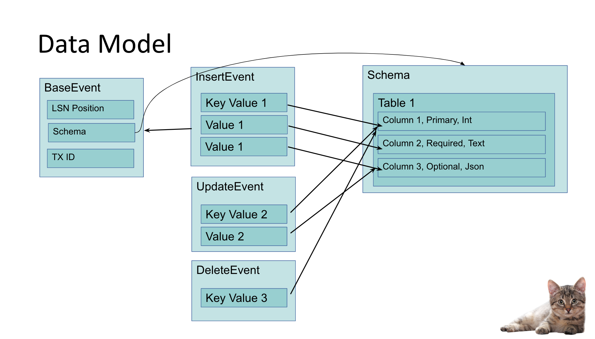
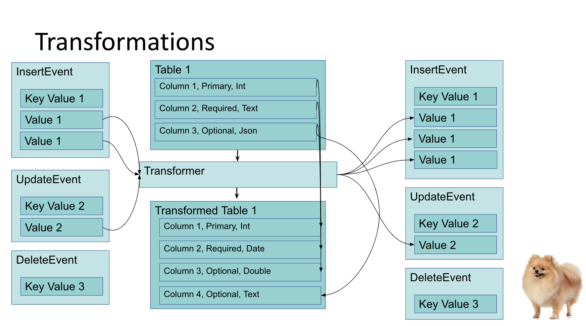

# Transformations in {{ data-transfer-name }}

{{ DC }} {{ data-transfer-name }} can apply transformations to the transferred data on the fly.

You can configure transformations when creating or editing a transfer.
To do that, click **+ Transformation** on the transfer configuration page and provide the desired settings.

The list of available transformations in each transfer depends on the source and target types.

## What is transformer

We can apply stateless transformation on our `inflight` data.
This is based on our data model



Each batch of changes can be transformed into new batch of changes:



### How to add new transformer

1. Create new package
2. Implemenet `abstract.Transformer` interface
3. Register implementation

Example:

#### Implementation of `abstract.Transformer`

```go
type DummyTransformer struct {
}

func (r *DummyTransformer) Apply(input []abstract.ChangeItem) abstract.TransformerResult {
	return abstract.TransformerResult{
		Transformed: input,
		Errors:      nil,
	}
}

func (r *DummyTransformer) Suitable(table abstract.TableID, schema abstract.TableColumns) bool {
	return true
}

func (r *DummyTransformer) ResultSchema(original abstract.TableColumns) abstract.TableColumns {
	return original
}

func (r *DummyTransformer) Description() string {
	return "this transformer do nothing"
}
```

## SQL

Performs SQL-like in-memory data transformations based on a provided query in the {{ CH }} SQL dialect.
The transformer is based on
[{{ CH }} Local ](https://clickhouse.com/docs/en/operations/utilities/clickhouse-local/) —
an isolated {{ CH }} database engine.

The source table inside {{ CH }} Local is named `table`.
The {{ CH }} table structure mimics the source table structure.

Because each source change item (row) contains extra metadata,
source and target data must match.
Therefore, each row must have a key defined.
All these keys must be unique in every batch.
For that, a collapse function is called.

If Transfer can't match source keys with the transformed data, it marks such rows as containing an error.



When writing an SQL query, you must preserve original key-columns:

```sql
SELECT
   parseDateTime32BestEffortJSONExtractString(CloudTrailEvent, 'eventTime')) AS eventTime,
   JSONExtractString(CloudTrailEvent, 'http_request.user_agent') AS http_useragent,    
   JSONExtractString(CloudTrailEvent, 'errorMessage') AS error_message,
   JSONExtractString(CloudTrailEvent, 'errorCode') AS error_kind, 
   JSONExtractString(CloudTrailEvent, 'sourceIPAddress') AS network_client_ip,
   JSONExtractString(CloudTrailEvent, 'eventVersion') AS eventVersion,
   JSONExtractString(CloudTrailEvent, 'eventSource') AS eventSource,
   JSONExtractString(CloudTrailEvent, 'eventName') AS eventName,
   JSONExtractString(CloudTrailEvent, 'awsRegion') AS awsRegion,
   JSONExtractString(CloudTrailEvent, 'sourceIPAddress') AS sourceIPAddress,
   JSONExtractString(CloudTrailEvent, 'userAgent') AS userAgent,
   JSONExtractString(CloudTrailEvent, 'requestID') AS requestID,
   JSONExtractString(CloudTrailEvent, 'eventID') AS eventID,
   JSONExtractBool(CloudTrailEvent, 'readOnly') AS readOnly,
   JSONExtractString(CloudTrailEvent, 'eventType') AS eventType,
   JSONExtractBool(CloudTrailEvent, 'managementEvent') AS managementEvent,
   JSONExtractString(CloudTrailEvent, 'recipientAccountId') AS recipientAccountId,
   JSONExtractString(CloudTrailEvent, 'eventCategory') AS eventCategory,
   JSONExtractString(CloudTrailEvent, 'aws_account') AS account,

   JSONExtractString(CloudTrailEvent, 'userIdentity.type') AS userIdentity_type,
   JSONExtractString(CloudTrailEvent, 'userIdentity.principalId') AS userIdentity_principalId,
   JSONExtractString(CloudTrailEvent, 'userIdentity.arn') AS userIdentity_arn,
   JSONExtractString(CloudTrailEvent, 'userIdentity.accountId') AS userIdentity_accountId,
   JSONExtractString(CloudTrailEvent, 'userIdentity.accessKeyId') AS userIdentity_accessKeyId,

   JSONExtractString(CloudTrailEvent, 'userIdentity.sessionContext.sessionIssuer.type') AS sessionIssuer_type,
   JSONExtractString(CloudTrailEvent, 'userIdentity.sessionContext.sessionIssuer.principalId') AS sessionIssuer_principalId,
   JSONExtractString(CloudTrailEvent, 'userIdentity.sessionContext.sessionIssuer.arn') AS sessionIssuer_arn,
   JSONExtractString(CloudTrailEvent, 'userIdentity.sessionContext.sessionIssuer.accountId') AS sessionIssuer_accountId,
   JSONExtractString(CloudTrailEvent, 'userIdentity.sessionContext.sessionIssuer.userName') AS sessionIssuer_userName,

   JSONExtractString(CloudTrailEvent, 'userIdentity.sessionContext.webIdFederationData.federatedProvider') AS federatedProvider,

   JSONExtractString(CloudTrailEvent, 'userIdentity.sessionContext.attributes.creationDate') AS attributes_creationDate,
   JSONExtractBool(CloudTrailEvent, 'userIdentity.sessionContext.attributes.mfaAuthenticated') AS attributes_mfaAuthenticated,

   JSONExtractString(CloudTrailEvent, 'requestParameters.commandId') AS requestParameters_commandId,
   JSONExtractString(CloudTrailEvent, 'requestParameters.instanceId') AS requestParameters_instanceId,

   JSONExtractString(CloudTrailEvent, 'tlsDetails.tlsVersion') AS tlsDetails_tlsVersion,
   JSONExtractString(CloudTrailEvent, 'tlsDetails.cipherSuite') AS tlsDetails_cipherSuite,
   JSONExtractString(CloudTrailEvent, 'tlsDetails.clientProvidedHostHeader') AS tlsDetails_clientProvidedHostHeader
FROM table
```



## Mask secret fields

Applies a hash function to specified columns in tables to further protect sensitive data during transfer.

## Columns filter

Applies filtering to the list of columns transferred from the data source.

## Rename tables

Associates a table name on the source with a new table name on the target 
without changing the contents of the transferred table.

## Replace primary key

Reassigns the primary key column on the target table.

## Convert values to string

Converts a certain data column in a specified table to a string.

## Convert data to raw JSON

Converts a certain data column in a specified table to raw JSON.

## Convert CDC data to raw JSON with history

Converts the 
[change data capture (CDC) data ](https://en.wikipedia.org/wiki/Change_data_capture)
to raw JSON with history.
